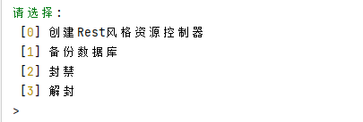
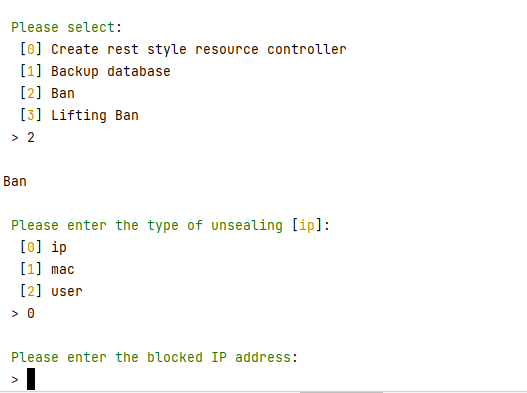

###  v1.1.7是不带封禁功能稳定版本，若您不想使用封禁功能，推荐使用此版本
###  v1.3.0是威妥码和汉语拼音互转的稳定版本，推荐使用此版本
###  v1.4.0是抛弃其他功能的版本，将会专注 通知类别 汇率互转 城市中英互转及威妥码拼音的更新
本包将持续更新！以下文档更新可能不及时，请详细文档查看

详细文档：https://learnku.com/docs/laravel-help-plugin/1.3.0


# Laravel辅助工具包

<p align="center">
    <a href="https://packagist.org/packages/chowjiawei/laravel-help-plugin" ></a> 
    <a href="https://packagist.org/packages/chowjiawei/laravel-help-plugin"></a> 
    <a></a> 
    <a></a>
</p>

 #### 支持钉钉机器人 企业微信机器人 微信模板消息/广播 Openexchangerates汇率实时获取的一个工具包

- [安装说明](#composer)
- [发布配置文件](#config)
- [注册门面方法](#facade)
- [消息驱动](#channel)
     - [钉钉机器人](#dingtalk)
     - [企业微信机器人](#wechat)
     - [微信模板消息](#wechatTemp)
- [直接消息推送](#usem)
     - [钉钉机器人](#usedingtalk)
     - [企业微信机器人](#usewechat)
     - [微信模板消息](#usewechatTemp)
     - [Artisan命令示例](#artisan)
- [国家获取转换](#country)
- [Openexchangerates汇率实时获取](#openexchangerates)
- [扩展Artisan命令](#extend)
  - [代码生成器](#generate)
    - [钉钉Notification模板生成](#generateDingtalk)
    - [企业微信Notification模板生成](#generateWechat)
    - [微信模板消息Notification模板生成](#generateWechat)
  - [模型生成](#generateModel)
  - [控制器生成](#generateController)
- [威妥码互转汉语拼音-移步详细文档查看](#e)
<a name="composer"></a>
# 安装说明

环境要求

- php => ^7.0
- guzzlehttp/guzzle => ^6.3"
- laravel/framework => ~5.5|~6.0|~7.0|~8.0,
- overtrue/laravel-wechat => ~5.0

工具包使用composer安装

`composer require chowjiawei/laravel-help-plugin`

<a name="config"></a>
# 发布配置文件

- 使用工具包请运行Artisan命令

`php artisan vendor:publish --provider="Chowjiawei\Helpers\Providers\HelpPluginServiceProvider"`

- 如若使用微信模板消息则需要发布easywechat配置:

`php artisan vendor:publish --provider="Overtrue\LaravelWeChat\ServiceProvider"`


```
<?php

/*
 * This file is part of the overtrue/laravel-wechat.
 *
 * (c) overtrue <i@overtrue.me>
 *
 * This source file is subject to the MIT license that is bundled
 * with this source code in the file LICENSE.
 */

return [
    /*
     * 默认配置，将会合并到各模块中
     */
    'defaults' => [
        /*
         * 指定 API 调用返回结果的类型：array(default)/collection/object/raw/自定义类名
         */
        'response_type' => 'array',

        /*
         * 使用 Laravel 的缓存系统
         */
        'use_laravel_cache' => true,

        /*
         * 日志配置
         *
         * level: 日志级别，可选为：
         *                 debug/info/notice/warning/error/critical/alert/emergency
         * file：日志文件位置(绝对路径!!!)，要求可写权限
         */
        'log' => [
            'level' => env('WECHAT_LOG_LEVEL', 'debug'),
            'file' => env('WECHAT_LOG_FILE', storage_path('logs/wechat.log')),
        ],
    ],

    /*
     * 路由配置
     */
    'route' => [
        /*
         * 开放平台第三方平台路由配置
         */
        // 'open_platform' => [
        //     'uri' => 'serve',
        //     'action' => Overtrue\LaravelWeChat\Controllers\OpenPlatformController::class,
        //     'attributes' => [
        //         'prefix' => 'open-platform',
        //         'middleware' => null,
        //     ],
        // ],
    ],

    /*
     * 公众号
     */
    'official_account' => [
        'default' => [
            'app_id' => env('WECHAT_OFFICIAL_ACCOUNT_APPID', 'your-app-id'),         // AppID
            'secret' => env('WECHAT_OFFICIAL_ACCOUNT_SECRET', 'your-app-secret'),    // AppSecret
            'token' => env('WECHAT_OFFICIAL_ACCOUNT_TOKEN', 'your-token'),           // Token
            'aes_key' => env('WECHAT_OFFICIAL_ACCOUNT_AES_KEY', ''),                 // EncodingAESKey

            /*
             * OAuth 配置
             *
             * scopes：公众平台（snsapi_userinfo / snsapi_base），开放平台：snsapi_login
             * callback：OAuth授权完成后的回调页地址(如果使用中间件，则随便填写。。。)
             */
            // 'oauth' => [
            //     'scopes'   => array_map('trim', explode(',', env('WECHAT_OFFICIAL_ACCOUNT_OAUTH_SCOPES', 'snsapi_userinfo'))),
            //     'callback' => env('WECHAT_OFFICIAL_ACCOUNT_OAUTH_CALLBACK', '/examples/oauth_callback.php'),
            // ],
        ],
    ],
];

```

<a name="facade"></a>
# 注册facade

打开`config/app.php`

找到 `providers` 项添加

```
\Chowjiawei\Helpers\Providers\HelpPluginServiceProvider::class,
```

找到 'aliases'添加

```
'Helper'=>\Chowjiawei\Helpers\Facade\Helper::class
```


<a name="channel"></a>
# 消息驱动


- [钉钉机器人](#dingtalk)
- [企业微信机器人](#wechat)
- [微信模板消息](#wechatTemp)


<a name="dingtalk"></a>
## 钉钉机器人消息发送驱动 

```
use Chowjiawei\Helpers\Channels\DingtalkRobotChannel;

public function via($notifiable)
{
    return [DingtalkRobotChannel::class];
}
```

<a name="wechat"></a>
## 微信机器人消息发送驱动

```
use Chowjiawei\Helpers\Channels\WechatRobotChannel;

public function via($notifiable)
{
    return [WechatRobotChannel::class];
}
```

<a name="wechatTemp"></a>
## 微信模板消息发送驱动

```
use Chowjiawei\Helpers\Channels\WechatTemplateMessageChannel;

public function via($notifiable)
{
    return [WechatTemplateMessageChannel::class];
}
```

```
Notification::route('dingtalk_robot', $key)->notify(new YourNotification());
Notification::route('wechat_robot', $key)->notify(new YourNotification());
Notification::route('Wechat_template_message', $key)->notify(new YourNotification());
```

<a name="usem"></a>
# 直接消息推送

- [钉钉机器人](#usedingtalk)
- [企业微信机器人](#usewechat)
- [微信模板消息](#usewechatTemp)

<a name="usedingtalk"></a>
### 钉钉:

`use Chowjiawei\Helpers\Notifications\DingtalkRobotNotification;`

`Notification::route('dingtalk_robot', env("DINGTALK_ROBOT"))
     ->notify(new DingtalkRobotNotification($message,$title));`

<a name="usewechat"></a>
### 企业微信:

`use Chowjiawei\Helpers\Notifications\WechatRobotNotification;`

`Notification::route('wechat_robot', env("WECHAT_ROBOT)"))
->notify(new DingtalkRobotNotification($message));`

<a name="usewechatTemp"></a>
### 微信模板消息:


`use Chowjiawei\Helpers\Notifications\WechatTemplateMessageNotification;`

- 不指定用户（广播用户）

`Notification::route('WechatTemplateMessage', null)->notify(new WechatTemplateMessageNotification($data));` 

- 指定用户

```
        $user=['odAYnxOVy7vS266666666','odAYnxEuuTCf66666fov276666'];

        $template="iA2V1K45vS8IgUEvE666666EH3R-V-66666";

        $data=[

            "order_id"=>[

                "value"=>"20200414234478934343",

                "color"=>"#173177"

            ],

            "package_id"=>[

                "value"=>"SF4345454534",

                "color"=>"#173177"

            ],

            "remark"=>[

                "value"=>'模板消息发送',

                "color"=>"#173177"

            ]

        ];

        Notification::route('WechatTemplateMessage', $user)->notify(new WechatTemplateMessageNotification($data, $template));

``` 

<a name="artisan"></a>
### Artisan命令示例:

由于业务不同，工具默认提供了通知Notification模板，可以通过extend Artisan命令选择代码生成器生成


<a name="country"></a>
# 国家获取转换


```
use Chowjiawei\Helpers\PhpHelps\LaravelHelp;

初始化辅助工具
$help=new LaravelHelp();

获取所有国家
$help->getAllCountry();

根据国家代码转国家名字 
$help->getCountryName('CN');
根据国家名字转国家代码
$help->getCountryName('China');
```

or
还有更多可以下载包后体验哦

```
Helper::allCountry();

```
<a name="openexchangerates"></a>
# Openexchangerates汇率实时获取

```
use Chowjiawei\Helpers\Exchange\Exchange;
//获取实时汇率
$help->getChangerates();
```
将为您返回完整的汇率及接口信息，以下省略篇幅
```
{
  "disclaimer": "Usage subject to terms: https://openexchangerates.org/terms",
  "license": "https://openexchangerates.org/license",
  "timestamp": 1622097300,
  "base": "USD",
  "rates": {
    "AED": 3.6731,
    "AFN": 79.130257,
    "ALL": 101.073262,
    "AMD": 520.828816,
    "ANG": 1.796011,
    "AOA": 643.121,
    "ARS": 94.4963,
    "AUD": 1.291358,
    "AWG": 1.8,
    "AZN": 1.700805,
    "BAM": 1.604705,
    "BBD": 2,
    "BDT": 85.048855,
    "BGN": 1.601902,
    "BHD": 0.377012,
    "BIF": 1974.680206,

```
```
use Chowjiawei\Helpers\Exchange\Exchange;
//获取特定汇率
$help->getSymbolChangerates(['GBP','EUR','AED','CAD']);
```
将为您返回指定的汇率及接口信息
```
{
    disclaimer: "https://openexchangerates.org/terms/",
    license: "https://openexchangerates.org/license/",
    "timestamp": 1424127600,
    "base": "USD",
    "rates": {
        "AED": 3.67295,
        "CAD": 0.99075,
        "EUR": 0.793903,
        "GBP": 0.62885
    }
}

```


<a name="extend"></a>
# 扩展Artisan命令
插件被您提供了一个支持中文和英文的扩展命令，您可以用命令呼出，命令提供了以下功能

```php artisan extend --chinese ```中文

```php artisan extend  ```英文

  - 创建Rest规范控制器





我们提供了个默认视图，`views/helpers/error.balde.php`,请根据您的页面协调更改样式


- [代码生成器](#generate)
  - [钉钉Notification模板生成](#generateDingtalk)
  - [企业微信Notification模板生成](#generateWechat)
  - [微信模板消息Notification模板生成](#generateWechat)
  - [模型生成](#generateModel)
  - [控制器生成](#generateController)

## 详情请移步详细文档

单汉语拼音转威妥码拼音

```
Helper::changeHWWord("zhou");
```


长句汉语拼音转威妥码拼音

```
Helper::changeHWWord("zhou jia wei hao shuai");
```


单汉语拼音转威妥码拼音

```
Helper::changeWHWord("chou");
```


长句汉语拼音转威妥码拼音

```
Helper::changeWHWord("chou chia wei hao shuai a");
```


待完善